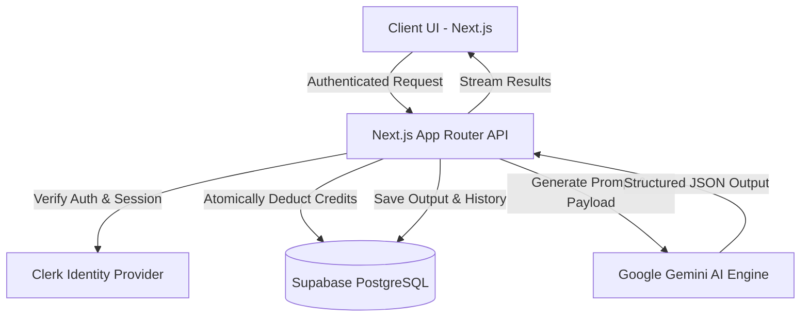

<div align="center">

# 🌌 WORKFORCE AI

### *The Decentralized AI Agent Workforce for Modern Professionals & Developers*

[](https://nextjs.org/)
[](https://www.typescriptlang.org/)
[](https://tailwindcss.com/)
[](https://supabase.com/)
[](https://clerk.com/)
[](https://deepmind.google/technologies/gemini/)

**WorkForce AI** is a state-of-the-art, full-stack AI productivity platform designed to delegate complex, time-consuming business and engineering workflows to a team of highly-specialized autonomous AI agents. Built with a sleek glassmorphism dark-theme UI, it blends advanced generative intelligence with flawless workflow execution.

[Explore Agents](#-the-agentic-workforce) • [System Architecture](#-system-architecture) • [Getting Started](#-getting-started) • [Database Schema](#-database-schema)

---
</div>

## ✨ Key Features

* **🤖 12 Specialized AI Agents**: Ready-to-use agents covering development, business analytics, education, and content creation.
* **⚡ Ultra-Fast Generation**: Powered by Google Gemini 2.5/3.5 Flash models for context-aware, hyper-optimized responses.
* **🔐 Enterprise-Grade Authentication**: Secured via Clerk with support for third-party OAuth providers.
* **💳 Real-Time Credit Ledger**: Atomic credit wallet system with an immutable transaction audit log built directly on PostgreSQL.
* **🎙️ Multi-Format Workflows**: Supports everything from GitHub repository analysis to long raw audio/transcript summarization.
* **🎨 Premium Glassmorphism UI**: Beautiful, interactive dashboard featuring curated HSL dark-mode gradients and micro-animations.

---

## 🛠️ System Architecture

WorkForce AI leverages a modern, event-driven, full-stack architecture that combines lightning-fast serverless executions with secure database locking:



---

## 👥 The Agentic Workforce

Our agents are grouped into specialized roles to handle your daily operations:

### 💻 Developer Hub
* **🔗 LinkedIn Tech Post**: Converts public GitHub repositories into high-engagement, hook-driven social media posts.
* **📄 Resume ATS Optimizer**: Analyzes resumes against standard job descriptions, scoring compatibility and optimizing text.
* **🏆 GitHub Portfolio Generator**: Generates high-impact profile README markdowns highlighting top repositories and languages.

### 🎙️ Business & Operations
* **🎙️ Meeting Notes AI**: Transforms raw transcripts or audio recordings into executive summaries and action items with owners.
* **📱 Social Media Pack**: Automatically creates a week of platform-optimized content across Twitter, LinkedIn, and Instagram.

### 🎓 Academic & Grading
* **✅ Assignment Verifier**: Grades student submissions against a rubric, evaluating writing quality, plagiarism, and AI-probability.

---

## ⚙️ Tech Stack & Dependencies

| Layer | Technologies | Description |
| :--- | :--- | :--- |
| **Frontend** | React 19, Next.js 15, Zustand, Tailwind CSS | Sleek, fast, state-managed glassmorphism UI |
| **Backend** | Next.js Server Actions, Route Handlers | Secure, serverless API execution layers |
| **Database** | Supabase, PostgreSQL | Relational modeling, real-time sync, and Row Level Security (RLS) |
| **Auth** | Clerk Auth | Enterprise-grade multi-tenant session management |
| **AI Engine** | Google Gemini API (Flash Models) | State-of-the-art context window and prompt reasoning |

---

## 🚀 Getting Started

### Prerequisites
* **Node.js**: v18.x or higher
* **npm** or **yarn**
* **Supabase** account (PostgreSQL)
* **Clerk** account (Authentication)

### 1. Clone & Install
```bash
git clone https://github.com/Shantanu112-bd/Workforce-ai.git
cd Workforce-ai
npm install
```

### 2. Environment Setup
Create a `.env` file in the root directory and populate it with your credentials (see `.env.example` for details):

```env
# Clerk Auth
NEXT_PUBLIC_CLERK_PUBLISHABLE_KEY=your-clerk-publishable-key
CLERK_SECRET_KEY=your-clerk-secret-key

# Supabase
NEXT_PUBLIC_SUPABASE_URL=your-supabase-url
NEXT_PUBLIC_SUPABASE_ANON_KEY=your-supabase-anon-key
SUPABASE_SERVICE_ROLE_KEY=your-supabase-service-role-key

# Google Gemini
GEMINI_API_KEY=your-gemini-api-key
GEMINI_MODEL=gemini-2.5-flash
```

### 3. Initialize Database
Go to your **Supabase SQL Editor** and execute the queries inside [supabase/schema.sql](file:///Users/macbook/.gemini/antigravity-ide/scratch/workforce-ai/supabase/schema.sql) to set up tables, RLS policies, triggers, and functions.

### 4. Run Locally
```bash
npm run dev
```
Open **[http://localhost:3000](http://localhost:3000)** (or port 3001) in your browser to see your application in action!

---

## 📄 Database Schema

The PostgreSQL schema is structured for atomic precision and scalability:
* **`users`**: Synced automatically from Clerk sessions.
* **`credit_wallets`**: Real-time balance tracking per account.
* **`credit_ledger`**: Immutable audit logs of all credit debits and refills.
* **`workflows`**: Detailed execution histories including inputs, tokens, and outputs.
* **`agents`**: Extensible metadata mapping for form schemas and prompt configurations.

---

<div align="center">
  <sub>Built with ❤️ by Shantanu Udhane</sub>
</div>
